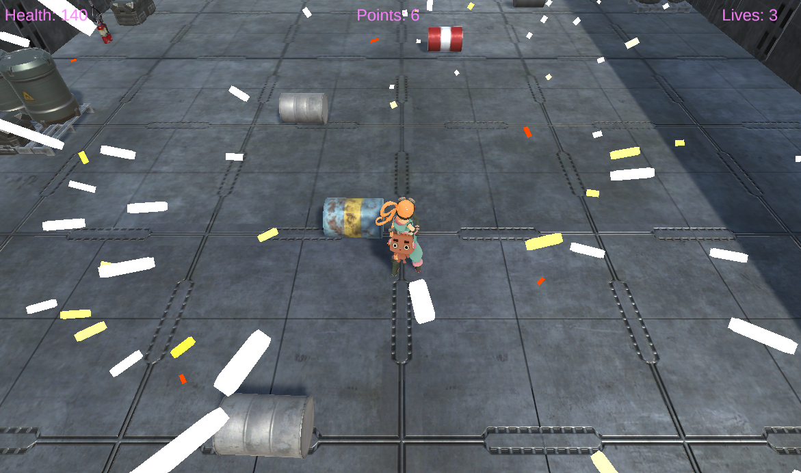
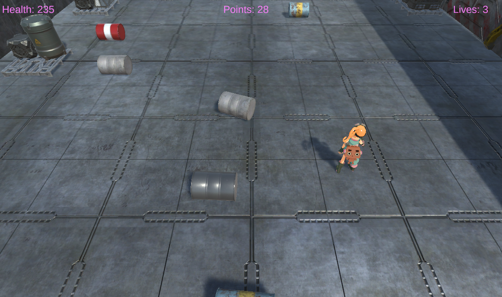

# Rolling Barrels

Rolling Barrels is a 3D Unity game built with C# where the player controls a mechanic girl running through a warehouse. The objective is to avoid rolling barrels, collect flying first aid jars, and survive as long as possible.

## Gameplay 🚀

- Control a mechanic girl avatar.
- Avoid rolling barrels that roll down the long warehouse.
- Collect first aid jars to restore health and earn points.
- Survive until the game ends and track points and health and lives.

## Features ✨

- 3D warehouse environment with moving floor and walls.
- Barrel obstacles with different barrel types and effects.
- Collectible powerups and health pickups.
- Score tracking and gradual spawn difficulty.
- Sound effects and visual particle feedback.

## Controls 🎮

- `Up Arrow`: Run / accelerate environment movement.
- `Left Arrow`: Move left.
- `Right Arrow`: Move right.

## Web Builds 🌐

Play the game in your browser using the following links:

- [**Itch Games**](https://captain-garneto.itch.io/sparkling-oil)
- [**Unity Play**](https://play.unity.com/en/games/5b1182ad-d41e-494e-baf7-b04c77d0e10e/rolling-barrels-of-sparkling-oil)

## Project Structure

- `Assets/Scripts/PlayerController.cs` — Player movement, collisions, UI updates, health, and game over behavior.
- `Assets/Scripts/EnvironmentManager.cs` — Movement and reset logic for the floor, walls, and decorative objects.
- `Assets/Scripts/MoveDown.cs` — Barrel movement and collision behavior.
- `Assets/Scripts/Powerups.cs` — Powerup movement logic.
- `Assets/Scripts/SpawnManager.cs` — Enemy and powerup spawning logic.
- `Assets/Scripts/GameConstants.cs` — Centralized configuration values for easier tuning.
- `Assets/Scripts/FallingObject.cs` — Shared movement behavior for falling objects.

## Notes 📘

This project is a Unity game prototype built for learning and experimentation with C# scripting and basic game mechanics.

## Author 👤

Daniel Anthony Rozek

[**Portfolio**](https://crispruby.github.io/), 
[**LinkedIn**](https://www.linkedin.com/in/danielrozek/), 
[**GitHub**](https://github.com/crispruby)

## License 📄

This project is open-source and available for educational and portfolio purposes.

## Screenshot Gallery 📸

  
  

